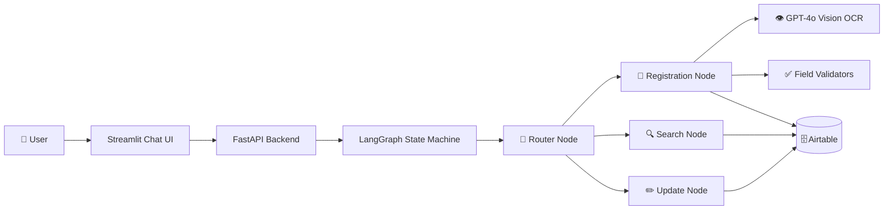

<div align="center">

# 💍 Nakshatra Match

### AI-Powered Matrimony Chatbot — Built with LangGraph

*A conversational registration & matchmaking engine*

[](https://www.python.org/)
[](https://langchain-ai.github.io/langgraph/)
[](https://fastapi.tiangolo.com/)
[](https://streamlit.io/)
[](https://airtable.com/)

[](LICENSE)
[](CONTRIBUTING.md)

</div>

---

## ✨ What is this?

A full **conversational chatbot** that replaces manual matrimony intake with a smart, validated, chat-first flow — no WhatsApp dependency, no spreadsheet chaos. Users register a bride/groom profile by *typing* or by *uploading a biodata document* (GPT-4o vision does the OCR), get validated field-by-field, wait for admin approval, and then search for matches — all inside a clean chat interface.

<div align="center">

| 🗣️ Chat-first registration | 📄 OCR from biodata uploads | ✅ 21-step field validation | 🔍 Smart match search |
|:---:|:---:|:---:|:---:|
| Type your way through | Upload a PDF/photo, auto-filled | Age, height, gothram cross-checks | Filter by age, Nakshatra, Rashi |

</div>

---

## 🧠 How it thinks



Every conversation flows through a single `BotState` object that LangGraph mutates step-by-step — deterministic, debuggable, and easy to extend with new nodes.

---

## 🎯 Core Features

- **🔤 Dual registration paths** — manual step-by-step chat, or upload a biodata file and let GPT-4o extract 16 fields automatically
- **🪐 Nakshatra & Rashi always asked manually** — even if OCR finds them, by design (accuracy matters here)
- **🛡️ Bulletproof validation** — age ≥ 18, realistic height ranges, Maternal Gothram ≠ Swa Gothram, mandatory time of birth & photo
- **📸 Photo capture** built directly into the Airtable attachment pipeline
- **⏳ Admin approval workflow** — profiles go `Pending` → `Approved`/`Rejected`, polled live so the UI announces status changes without user action
- **🔎 Match search** — filter the opposite table by age range, with optional Nakshatra/Rashi narrowing
- **🔒 Locked fields** — `Admin_Approval`, `Category`, `Phone_Number` can never be edited via chat

---

## 🏗️ Project Structure

```
matrimony_bot/
├── main.py                    # FastAPI app — /chat, /upload, /reset, /poll
├── setup_airtable.py          # One-shot schema + connectivity verifier
├── requirements.txt
├── .env.example
│
├── config/
│   ├── settings.py             # Env var loader
│   └── constants.py            # Nakshatra/Rashi lists, salary bands, field maps
│
├── state/
│   └── bot_state.py            # BotState TypedDict
│
├── memory/
│   └── memory_store.py         # Session store
│
├── tools/
│   ├── airtable_tools.py       # Create / read / update / search Airtable
│   └── ocr_tools.py            # GPT-4o biodata extraction
│
├── validators/
│   ├── field_validators.py     # DOB, age, height, phone, gothram checks
│   └── autocorrect.py          # Nakshatra & Rashi fuzzy matching
│
├── nodes/
│   ├── router_node.py          # Master router + menu/FAQ/admin
│   ├── registration_node.py    # 21-step registration flow
│   ├── search_node.py          # Match search
│   └── update_node.py          # Single-field updates
│
├── graphs/
│   └── bot_graph.py            # LangGraph wiring
│
└── ui/
    └── app.py                  # Streamlit chat UI
```

---

## 🚀 Quick Start

### 1️⃣ Clone & install

```bash
git clone https://github.com/<your-username>/nakshatra-match.git
cd nakshatra-match
python -m venv .venv
source .venv/bin/activate      # Windows: .venv\Scripts\activate
pip install -r requirements.txt
```

### 2️⃣ Set up Airtable

Create a base with `Groom` and `Bride` tables — full field spec is in [`SETUP.md`](SETUP.md). Grab a [Personal Access Token](https://airtable.com/create/tokens) with `data.records:read/write` + `schema.bases:read` scopes.

### 3️⃣ Configure environment

```bash
cp .env.example .env
# fill in OPENAI_API_KEY, AIRTABLE_API_KEY, AIRTABLE_BASE_ID
```

### 4️⃣ Verify the connection

```bash
python setup_airtable.py
```

### 5️⃣ Run it — two terminals

```bash
# Terminal 1 — backend
uvicorn main:app --reload

# Terminal 2 — chat UI
streamlit run ui/app.py
```

Open the Streamlit URL (usually `http://localhost:8501`) and the bot greets you. 🎉

---

## 🔒 Non-negotiable Rules

| Rule | Enforced in |
|---|---|
| Age ≥ 18 | `validators/field_validators.py` |
| Realistic height (3'–7') | `validators/field_validators.py` |
| Maternal Gothram ≠ Swa Gothram | `validate_maternal_gothram` |
| Nakshatra & Rashi always manual | `tools/ocr_tools.py` strips them from OCR |
| Time of Birth mandatory | No skip path in registration |
| Photo mandatory | Required before contact number |
| Restricted fields locked | `config/constants.py → RESTRICTED_FIELDS` |
| Search re-verifies approval every time | `nodes/search_node.py` |

---

## 🛠️ Tech Stack

<div align="center">

`LangGraph` · `LangChain` · `FastAPI` · `Streamlit` · `Airtable` · `GPT-4o Vision` · `Pydantic`

</div>

---

## 🧭 Roadmap

- [ ] Swap in-memory session store → Redis
- [ ] Upload photos to Cloudinary/S3 → Airtable attachment via public URL
- [ ] WhatsApp Cloud API webhook (drop-in for the chat endpoint)
- [ ] In-app admin dashboard for approvals
- [ ] Nightly profile freshness audit job

---

<div align="center">

Built with ❤️ and langgraph

</div>
